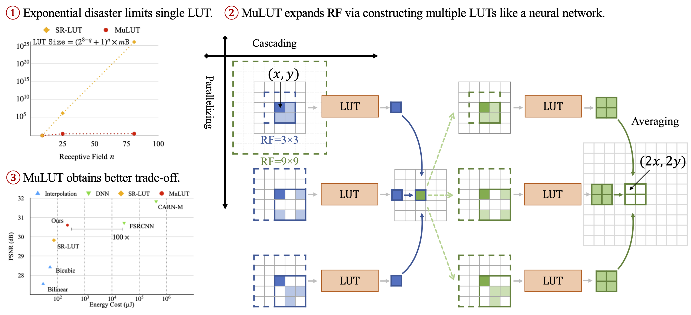

## [ECCV 2022] MuLUT: Cooperating Mulitple Look-Up Tables for Efficient Image Super-Resolution
## [TPAMI 2024] Toward DNN of LUTs: Learning Efficient Image Restoration with Multiple Look-Up Tables

[Jiacheng Li](http://ddlee-cn.github.io), Chang Chen, Zhen Cheng, and [Zhiwei Xiong#](http://staff.ustc.edu.cn/~zwxiong)


[ECCV Paper](https://www.ecva.net/papers/eccv_2022/papers_ECCV/papers/136780234.pdf) | [ECCV Paper Supp.](https://www.ecva.net/papers/eccv_2022/papers_ECCV/papers/136780234-supp.pdf) | [T-PAMI Paper](https://ieeexplore.ieee.org/document/10530442/) | [Poster](https://mulut.pages.dev/static/MuLUT-Poster-ECCV22.pdf) | [Project Page](https://mulut.pages.dev) | [Intro Video](https://youtu.be/xmvQYW7dtaE)

## News

2024.06 Our new work, [Diagonal-First Compression for LUT(DFC)](https://github.com/leenas233/DFC) has been presented as a highlight paper at CVPR 2024. DFC reduce the storage requirement of restoration LUTs significantly (up to 10%) while preserving their performance.

2024.05 The extended version of MuLUT, DNN-of-LUT, is accepted by [IEEE T-PAMI](https://ieeexplore.ieee.org/document/10530442/).

2023.03 Extended version of MuLUT is available on [arxiv](https://arxiv.org/abs/2303.14506).

2023.02 Our new work, [Learning Resampling Function(LeRF)](https://lerf.pages.dev), is accepted by CVPR 2023. LeRF makes up for the regrets of MuLUT on replacing interpolation methods via achiving continuous resampling.

2022.10 MuLUT is open sourced.

## At A Glance



Please learn more at our [project page](https://mulut.pages.dev).

## Usage

### Code overview

In the `sr` directory, we provide the code of training MuLUT networks, transferring MuLUT network into LUts, finetuning LUTs, and testing LUTs, taking the task of single image super-resolution as an example. 

In the `common/network.py` file, we provide a universal implementation of MuLUT blocks, which can be constructed into MuLUT networks in a lego-like way.

### Dataset

Please following the instructions of [training](./data/DIV2K/README.md) and [testing](./data/SRBenchmark/README.md).

### Step 0: Installation

Clone this repo.

```
git clone https://github.com/ddlee-cn/MuLUT
```

Install requirements: `torch>=1.5.0`, `opencv-python`, `scipy`


### Step 1: Training MuLUT network

First, let us train a MuLUT network.

```
cd sr
python 1_train_model.py --stages 2 --modes sdy -e ../models/sr_x2sdy \
                        --trainDir ../data/DIV2K --valDir ../data/SRBenchmark
```
Our trained model and log are available under the `models/sr_x2sdy` directory.

### Step 2: Transfer MuLUT blocks into LUTs

Now, we are ready to cache the MuLUT network into multiple LUTs.

```
python 2_transfer_to_lut.py --stages 2 --modes sdy -e ../models/sr/x2sdy
```


### Step 3: Fine-tuning LUTs

```
python 3_finetune_lut.py --stages 2 --modes sdy -e ../models/sr_x2sdy \
                        --trainDir ../data/DIV2K --valDir ../data/SRBenchmark
```

After fine-tuning, LUTs are saved into `.npy` files and can be deployed on other devices. Our fine-tuned LUTs and log are available under the `models/sr_x2sdy` directory.


### Step 4: Test LUTs

Finally, we provide the following script to execute the LUT retrieval.

```
python 4_test_lut.py --stages 2 --modes sdy -e ../models/sr_x2sdy
```

The reference results for the `Set5` dataset are provided under the `results/sr_x2sdy` directory.


## Contact
If you have any questions, feel free to contact me by e-mail `jclee [at] mail.ustc.edu.cn`.


## Citation
If you find our work helpful, please cite the following papers.

```
@InProceedings{Li_2022_MuLUT,
      author    = {Li, Jiacheng and Chen, Chang and Cheng, Zhen and Xiong, Zhiwei},
      title     = {{MuLUT}: Cooperating Multiple Look-Up Tables for Efficient Image Super-Resolution},
      booktitle = {ECCV},
      year      = {2022},
  }
  
@ARTICLE{10530442,
      author    = {Li, Jiacheng and Chen, Chang and Cheng, Zhen and Xiong, Zhiwei},
      title     = {Toward {DNN} of {LUTs}: Learning Efficient Image Restoration with Multiple Look-Up Tables},
      journal   = {IEEE Transactions on Pattern Analysis and Machine Intelligence}, 
      year      = {2024},
      volume    = {},
      number    = {},
      pages     = {1-18},
      doi       = {10.1109/TPAMI.2024.3401048}
  }
  

@InProceedings{Li_2023_LeRF,
      author    = {Li, Jiacheng and Chen, Chang and Huang, Wei and Lang, Zhiqiang and Song, Fenglong and Yan, Youliang and Xiong, Zhiwei},
      title     = {Learning Steerable Function for Efficient Image Resampling},
      booktitle = {CVPR},
      year      = {2023},
  }
```


## License
MIT


## Acknowledgement

Our code is build upon [SR-LUT](https://github.com/yhjo09/SR-LUT).
